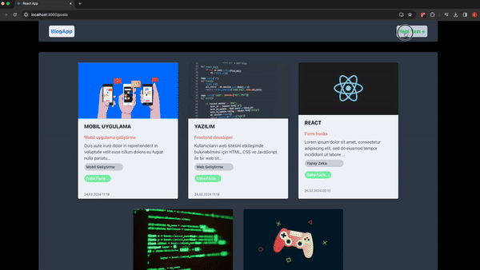

# Blog Application

This project aims to create a simple blog application where users can view, add, update, and delete blog posts.
The application is developed with React and utilizes user-friendly interfaces with libraries such as React Router, React Hook Form, and React Select. Axios is used for data management and communication with the server.

MongoDB is employed as the database, and Express.js with Mongoose is used on the server side.

## Technologies

The main technologies used in this project:

- [React](https://reactjs.org/)
- [React Router](https://reactrouter.com/)
- [React Hook Form](https://react-hook-form.com/)
- [React Select](https://react-select.com/)
- [Axios](https://axios-http.com/)
- [Moment.js](https://momentjs.com/)
- [Zod](https://github.com/colinhacks/zod)
- [Express.js](https://expressjs.com/)
- [MongoDB](https://www.mongodb.com/)
- [Mongoose](https://mongoosejs.com/)

## Installation

Clone the project files to your computer and run the following commands to install the necessary dependencies:

```bash
npm install

```


